# Ontology Analysis Report

This report is auto-generated by `src/run_analysis.py`. It provides quantitative metrics, affordance coverage analysis, graspability reasoning explanations, and a class hierarchy diagram for the Group 10 Semantic Affordance Grounding ontology.

## 1. Ontology Metrics

| Metric | Value |
| --- | --- |
| Source triples (before reasoning) | 351 |
| Inferred triples (after reasoning) | 1057 |
| OWL/RDFS classes | 23 |
| Classes in cap: namespace | 22 |
| Classes in g10: namespace | 0 |
| Object properties | 5 |
| Datatype properties | 4 |
| Group 10 individuals | 21 |

## 2. Affordance Coverage Matrix

| Object | Grasping | Support | Containment | Stackability |
| --- | --- | --- | --- | --- |
| g10:basket01 | — | — | ✓ | — |
| g10:block01 | ✓ | — | — | — |
| g10:block02 | ✓ | — | — | — |
| g10:blueCup01 | ✓ | — | — | ✓ |
| g10:fork01 | ✓ | — | — | — |
| g10:knife01 | ✓ | — | — | — |
| g10:pinkCup01 | ✓ | — | — | ✓ |
| g10:plate01 | — | ✓ | — | — |

## 3. Graspability Reasoning Explanation

For each Group 10 physical object, the table below shows the inference chain that determines graspability.

| Object | Type | Affordances | Has Grasping? | Inferred Graspable? |
| --- | --- | --- | --- | --- |
| g10:basket01 | cap:Basket | Containment | ✗ | ✗ Not graspable |
| g10:block01 | cap:ToyBlock | Grasping | ✓ | ✓ GraspableObject |
| g10:block02 | cap:ToyBlock | Grasping | ✓ | ✓ GraspableObject |
| g10:blueCup01 | cap:Cup | Grasping, Stackability | ✓ | ✓ GraspableObject |
| g10:fork01 | cap:Fork | Grasping | ✓ | ✓ GraspableObject |
| g10:knife01 | cap:Knife | Grasping | ✓ | ✓ GraspableObject |
| g10:pinkCup01 | cap:Cup | Grasping, Stackability | ✓ | ✓ GraspableObject |
| g10:plate01 | cap:Plate | Support | ✗ | ✗ Not graspable |

**Summary**: 6 objects inferred as graspable, 2 objects not graspable.

## 4. Class Hierarchy Diagram

The following Mermaid diagram shows the `rdfs:subClassOf` relationships among course and group classes.

```mermaid
graph TD
    cap_PhysicalObject["cap:PhysicalObject"] --> cap_Basket["cap:Basket"]
    cap_TaskRole["cap:TaskRole"] --> cap_CollectableObject["cap:CollectableObject"]
    cap_TaskRole["cap:TaskRole"] --> cap_ContainerTarget["cap:ContainerTarget"]
    cap_Affordance["cap:Affordance"] --> cap_ContainmentAffordance["cap:ContainmentAffordance"]
    cap_PhysicalObject["cap:PhysicalObject"] --> cap_Cup["cap:Cup"]
    cap_PhysicalObject["cap:PhysicalObject"] --> cap_Fork["cap:Fork"]
    cap_PhysicalObject["cap:PhysicalObject"] --> cap_GraspableObject["cap:GraspableObject"]
    cap_Affordance["cap:Affordance"] --> cap_GraspingAffordance["cap:GraspingAffordance"]
    cap_PhysicalObject["cap:PhysicalObject"] --> cap_Knife["cap:Knife"]
    cap_Task["cap:Task"] --> cap_ManipulationTask["cap:ManipulationTask"]
    cap_PhysicalObject["cap:PhysicalObject"] --> cap_Plate["cap:Plate"]
    cap_TaskRole["cap:TaskRole"] --> cap_ReferenceObject["cap:ReferenceObject"]
    cap_Affordance["cap:Affordance"] --> cap_StackabilityAffordance["cap:StackabilityAffordance"]
    cap_Affordance["cap:Affordance"] --> cap_SupportAffordance["cap:SupportAffordance"]
    cap_TaskRole["cap:TaskRole"] --> cap_TargetObject["cap:TargetObject"]
    cap_PhysicalObject["cap:PhysicalObject"] --> cap_ToyBlock["cap:ToyBlock"]
```

